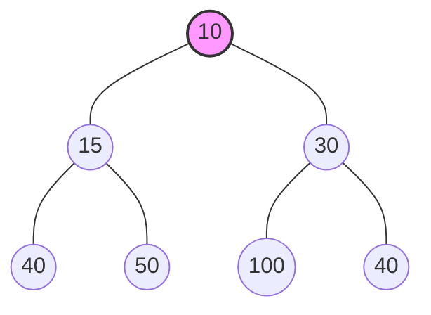

# Heap Data Structure

> A **Heap** is a specialized tree-based data structure that satisfies the **Heap Property**. It is the most efficient way to implement a Priority Queue and is widely used when you frequently need to access the maximum or minimum element in a dataset.

---

## 1. Definition

A Heap is a **Complete Binary Tree** (a tree where every level is completely filled except possibly the last, which is filled from left to right) in which every parent node follows a specific ordering relative to its children. 
- In a **Max Heap**, the parent is always greater than or equal to its children.
- In a **Min Heap**, the parent is always less than or equal to its children.

---

## 2. Why this Data Structure Exists

While a sorted array allows finding the max/min element in $O(1)$ time, inserting a new element takes $O(N)$ time. Conversely, an unsorted array allows $O(1)$ insertion but finding the max/min takes $O(N)$.
Heaps were created to strike a balance: they allow **insertion in $O(\log N)$** and **finding/removing the max/min in $O(\log N)$**. This makes them perfectly suited for scenarios where data is constantly being added and the highest/lowest priority item needs to be continuously retrieved.

---

## 3. Real-World Analogy

Imagine an Emergency Room (ER) in a hospital. 
Patients don't get treated strictly in the order they arrive (FIFO). Instead, they are treated based on the **severity of their condition** (Priority). 
- A patient with a heart attack (High Priority/Max value) immediately jumps to the top of the line.
- A patient with a minor cut (Low Priority) waits until more severe cases are handled. 
A **Max Heap** efficiently manages this dynamic waiting room, ensuring the highest priority patient is always at the front.

---

## 4. Internal Working & Array Representation

Even though a heap is conceptualized as a binary tree, it is almost always implemented under the hood as a flat **Array**. Because a heap is a *Complete Binary Tree*, there are no "gaps" in the tree, meaning we can map tree nodes to array indices perfectly without wasting space.

If a node is placed at index `i` (using 0-based indexing):
*   **Left Child:** `2 * i + 1`
*   **Right Child:** `2 * i + 2`
*   **Parent:** `Math.floor((i - 1) / 2)`

---

## 5. Visualization

<details>
<summary>Click to view Min Heap and Array Representation</summary>



**Array Representation:**
`[10, 15, 30, 40, 50, 100, 40]`
- Index `0` (10) -> Children at `1` (15) and `2` (30).
- Index `1` (15) -> Children at `3` (40) and `4` (50).

</details>

---

## 6. Types

There are two primary variants of binary heaps:

1.  **Max Heap:** The root node holds the maximum value. Every parent node is $\ge$ its children.
2.  **Min Heap:** The root node holds the minimum value. Every parent node is $\le$ its children.

---

## 7. Properties

*   **Shape Property:** A binary heap is always a Complete Binary Tree.
*   **Heap Property:** All nodes are either greater than/equal to (Max Heap) or less than/equal to (Min Heap) their children.
*   **Weak Ordering:** Siblings have no specific order relative to each other (unlike a Binary Search Tree).

---

## 8. Time Complexity

| Operation | Best Case | Average Case | Worst Case | Description |
| :--- | :--- | :--- | :--- | :--- |
| **Get Max/Min (Peek)** | $O(1)$ | $O(1)$ | $O(1)$ | Root element is always at index 0. |
| **Insert** | $O(1)$ | $O(\log N)$ | $O(\log N)$ | Insert at end, then Heapify Up. |
| **Delete Max/Min** | $O(1)$ | $O(\log N)$ | $O(\log N)$ | Swap root with last element, pop, Heapify Down. |
| **Search** | $O(N)$ | $O(N)$ | $O(N)$ | Heaps are not built for searching arbitrary elements. |
| **Build Heap** | $O(N)$ | $O(N)$ | $O(N)$ | Using Floyd's approach (bottom-up heapify). |

---

## 9. Space Complexity

| Aspect | Complexity | Description |
| :--- | :--- | :--- |
| **Storage** | $O(N)$ | An array of size $N$ is required to store the elements. |
| **Auxiliary (Call Stack)** | $O(\log N)$ | If recursion is used for Heapify. $O(1)$ if iterative. |

---

## 10. Advantages & Disadvantages

### Advantages
*   Extremely fast $O(1)$ access to the highest or lowest priority element.
*   Array-based implementation is highly memory-efficient (no pointer overhead like in standard trees).
*   Excellent cache locality due to array storage.
*   Building a heap from an unsorted array takes only $O(N)$ time.

### Disadvantages
*   Searching for an arbitrary element takes $O(N)$ because the tree isn't strictly sorted like a BST.
*   Not a stable data structure (relative order of equal elements isn't preserved).
*   Deleting an arbitrary element (not the root) is slow $O(N)$.

---

## 11. Common Mistakes & Edge Cases

### Common Mistakes
*   **Confusing with BST:** Assuming the left child is smaller than the right child. *Heaps have no left/right ordering.*
*   **1-based vs 0-based Indexing:** Forgetting that formula changes depending on whether the array starts at index 0 or index 1.
*   **Heapify Direction:** Using `heapifyDown` after an insertion instead of `heapifyUp`.

### Edge Cases
*   Extracting from an empty heap.
*   Heapifying an array that is already a valid heap or reverse-sorted.
*   Inserting duplicate values (perfectly valid, but relative order isn't guaranteed).

---

## 12. JavaScript Implementation

<details>
<summary>Click to expand Min Heap Implementation</summary>

```javascript
class MinHeap {
    constructor() {
        this.heap = [];
    }

    // Helper Methods
    getLeftChildIndex(parentIndex) { return 2 * parentIndex + 1; }
    getRightChildIndex(parentIndex) { return 2 * parentIndex + 2; }
    getParentIndex(childIndex) { return Math.floor((childIndex - 1) / 2); }
    hasLeftChild(index) { return this.getLeftChildIndex(index) < this.heap.length; }
    hasRightChild(index) { return this.getRightChildIndex(index) < this.heap.length; }
    hasParent(index) { return this.getParentIndex(index) >= 0; }
    leftChild(index) { return this.heap[this.getLeftChildIndex(index)]; }
    rightChild(index) { return this.heap[this.getRightChildIndex(index)]; }
    parent(index) { return this.heap[this.getParentIndex(index)]; }

    swap(indexOne, indexTwo) {
        const temp = this.heap[indexOne];
        this.heap[indexOne] = this.heap[indexTwo];
        this.heap[indexTwo] = temp;
    }

    peek() {
        if (this.heap.length === 0) return null;
        return this.heap[0];
    }

    // INSERT OPERATION: O(log N)
    insert(item) {
        this.heap.push(item); // Add to the end of the array
        this.heapifyUp();     // Bubble it up to its correct position
    }

    heapifyUp() {
        let index = this.heap.length - 1;
        while (this.hasParent(index) && this.parent(index) > this.heap[index]) {
            this.swap(this.getParentIndex(index), index);
            index = this.getParentIndex(index);
        }
    }

    // EXTRACT MIN OPERATION: O(log N)
    extractMin() {
        if (this.heap.length === 0) return null;
        const item = this.heap[0];
        this.heap[0] = this.heap[this.heap.length - 1]; // Move last element to root
        this.heap.pop();                                // Remove duplicate last element
        this.heapifyDown();                             // Bubble root down to correct position
        return item;
    }

    heapifyDown() {
        let index = 0;
        while (this.hasLeftChild(index)) {
            let smallerChildIndex = this.getLeftChildIndex(index);
            // If right child exists and is smaller than left child
            if (this.hasRightChild(index) && this.rightChild(index) < this.leftChild(index)) {
                smallerChildIndex = this.getRightChildIndex(index);
            }

            if (this.heap[index] < this.heap[smallerChildIndex]) {
                break; // Everything is balanced
            } else {
                this.swap(index, smallerChildIndex);
            }
            index = smallerChildIndex;
        }
    }
    
    // BUILD HEAP: O(N)
    buildHeap(array) {
        this.heap = array;
        // Start from the last non-leaf node down to the root
        let startIdx = Math.floor((this.heap.length / 2) - 1);
        for (let i = startIdx; i >= 0; i--) {
            this.heapifyDownFromIndex(i);
        }
    }
    
    // Helper for buildHeap
    heapifyDownFromIndex(index) {
        let currentIndex = index;
        while (this.hasLeftChild(currentIndex)) {
            let smallerChildIndex = this.getLeftChildIndex(currentIndex);
            if (this.hasRightChild(currentIndex) && this.rightChild(currentIndex) < this.leftChild(currentIndex)) {
                smallerChildIndex = this.getRightChildIndex(currentIndex);
            }
            if (this.heap[currentIndex] < this.heap[smallerChildIndex]) break;
            this.swap(currentIndex, smallerChildIndex);
            currentIndex = smallerChildIndex;
        }
    }
}
```
</details>

---

## 13. Dry Run / Walkthrough

Let's dry run the **Insertion** of `[10, 20, 5, 15]` into an empty Min Heap.

1.  **Insert 10**:
    *   Array: `[10]`
    *   No parent to check.
2.  **Insert 20**:
    *   Array: `[10, 20]`
    *   Compare 20 with parent (10). 20 > 10. Valid.
3.  **Insert 5**:
    *   Array: `[10, 20, 5]`
    *   `heapifyUp()`: Compare 5 with parent (10). 5 < 10. Swap!
    *   Array becomes: `[5, 20, 10]`
4.  **Insert 15**:
    *   Array: `[5, 20, 10, 15]`
    *   `heapifyUp()`: Compare 15 with parent (20). 15 < 20. Swap!
    *   Array becomes: `[5, 15, 10, 20]`
    *   Compare 15 with parent (5). 15 > 5. Valid. Stop.

Final Array: `[5, 15, 10, 20]`

---

## 14. Applications / Use Cases

*   **Priority Queues:** Scheduling processes in Operating Systems, traffic routing, Huffman encoding.
*   **Heap Sort:** An in-place $O(N \log N)$ sorting algorithm.
*   **Graph Algorithms:** Dijkstra's Shortest Path and Prim's Minimum Spanning Tree heavily rely on priority queues (Min Heaps) to efficiently fetch the minimum weight edge.
*   **K-th Largest/Smallest Elements:** Finding the top $K$ frequent words or closest points to origin efficiently without fully sorting the data.
*   **Median of Data Stream:** Maintaining a running median using two heaps (one Max Heap for the lower half, one Min Heap for the upper half).

---

## 15. Common Interview Questions

1.  *What is the difference between a Binary Search Tree and a Heap?*
2.  *Why does building a Heap from an array take $O(N)$ time instead of $O(N \log N)$?*
3.  *How would you find the K-th largest element in a stream of numbers?*
4.  *Is Heap Sort stable? Why or why not?*
5.  *Can you implement a Max Heap using a Min Heap implementation? (Yes, by negating the values).*

---

## 16. Related LeetCode Problems

*   [215. Kth Largest Element in an Array](https://leetcode.com/problems/kth-largest-element-in-an-array/) (Medium)
*   [347. Top K Frequent Elements](https://leetcode.com/problems/top-k-frequent-elements/) (Medium)
*   [23. Merge k Sorted Lists](https://leetcode.com/problems/merge-k-sorted-lists/) (Hard)
*   [295. Find Median from Data Stream](https://leetcode.com/problems/find-median-from-data-stream/) (Hard)
*   [973. K Closest Points to Origin](https://leetcode.com/problems/k-closest-points-to-origin/) (Medium)

---

## 17. Related Topics

*   [Priority Queue](./priority-queue.md)
*   [Heap Sort](./heap-sort.md)
*   [Binary Search Tree](../trees/bst.md)
*   [Dijkstra's Algorithm](../graphs/shortest-path.md)
