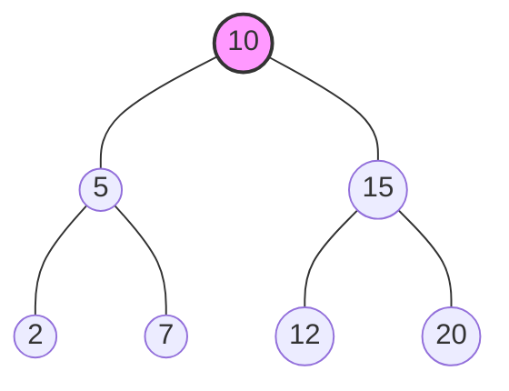

# Binary Search Tree (BST)

> A **Binary Search Tree (BST)** is a node-based binary tree data structure where every node follows a specific ordering property: all values in the left subtree are smaller than the root, and all values in the right subtree are larger.

---

## 1. Definition

A Binary Search Tree is a binary tree in which each node has at most two children (referred to as the left child and the right child). It enforces a strict sorted property across all nodes:
*   The **left subtree** of a node contains only nodes with keys **less than** the node's key.
*   The **right subtree** of a node contains only nodes with keys **greater than** the node's key.
*   Both the left and right subtrees must also be binary search trees.

---

## 2. Why this Data Structure Exists

Standard Arrays allow fast $O(1)$ read access but slow $O(N)$ insertion/deletion because elements must be shifted. Linked Lists allow fast $O(1)$ insertion/deletion (if the node is known) but slow $O(N)$ searching.
A Binary Search Tree exists to combine the best of both worlds. By keeping data sorted hierarchically, a balanced BST allows **searching, insertion, and deletion all in $O(\log N)$ time**, making it an incredibly efficient structure for dynamic datasets.

---

## 3. Real-World Analogy

Imagine looking for a specific word, like "Mango", in a physical dictionary.
You don't read every single word from the first page (Linear Search). Instead, you open the dictionary to the middle. If you land on "Peach", you know "Mango" comes *before* "Peach" alphabetically, so you discard the entire right half of the dictionary and search only the left half. You repeat this halving process until you find "Mango". 
A BST structures data exactly like this, allowing you to discard half the remaining search space at every step.

---

## 4. Internal Working

A BST is typically implemented using nodes that contain:
1.  A **value** (or key/data).
2.  A pointer to the **left child**.
3.  A pointer to the **right child**.

When you search or insert, you start at the root node. You compare your target value with the current node's value. If it's smaller, you traverse to the left child. If it's larger, you traverse to the right child. You continue this until you find the value (for search) or hit a `null` spot (for insertion).

---

## 5. Visualization

<details>
<summary>Click to view BST Diagram</summary>



*   **Root:** 10
*   **Left Subtree of 10:** Contains [5, 2, 7] (all < 10)
*   **Right Subtree of 10:** Contains [15, 12, 20] (all > 10)

</details>

---

## 6. Core Properties

*   **Inorder Traversal is Sorted:** Performing an Inorder Traversal (Left, Root, Right) on a valid BST always yields the elements in strictly increasing sorted order.
*   **No Duplicates:** Standard BSTs do not allow duplicate values. If duplicates are required, they are either placed strictly on the right (or left), or a counter is kept inside the node.
*   **Height:** The height of a balanced BST with $N$ nodes is $\approx \log_2(N)$. 

---

## 7. Balanced vs Unbalanced BST

The efficiency of a BST depends entirely on its height.

### Balanced BST
A tree where the height of the left and right subtrees for every node differ by at most 1.
*   **Example:** AVL Tree, Red-Black Tree.
*   **Performance:** Guaranteed $O(\log N)$ for operations.

### Unbalanced (Degenerate) BST
If you insert sorted data (e.g., `1, 2, 3, 4, 5`) into a standard BST, every new node becomes the right child of the previous node. The tree becomes a straight line (essentially a Linked List).
*   **Performance:** Degrades to $O(N)$ for all operations.

---

## 8. Core Operations

*   **Insert:** Traverse the tree to find an empty spot and attach the new node.
*   **Search:** Traverse left if target is smaller, traverse right if target is larger.
*   **Delete:** 
    *   *Case 1 (Leaf Node):* Simply remove it.
    *   *Case 2 (One Child):* Replace the node with its child.
    *   *Case 3 (Two Children):* Find the **Inorder Successor** (smallest node in the right subtree), replace the node's value with the successor's value, and delete the successor.
*   **Traversals:**
    *   **Inorder (DFS):** Left $\rightarrow$ Root $\rightarrow$ Right (Returns sorted data).
    *   **Preorder (DFS):** Root $\rightarrow$ Left $\rightarrow$ Right (Useful for cloning a tree).
    *   **Postorder (DFS):** Left $\rightarrow$ Right $\rightarrow$ Root (Useful for deleting a tree).
    *   **Level Order (BFS):** Top-to-bottom, left-to-right (Uses a Queue).

---

## 9. Time Complexity

| Operation | Average Case (Balanced) | Worst Case (Unbalanced) | Description |
| :--- | :--- | :--- | :--- |
| **Search** | $O(\log N)$ | $O(N)$ | Halves the search space at each step. |
| **Insert** | $O(\log N)$ | $O(N)$ | Traverses down the height of the tree. |
| **Delete** | $O(\log N)$ | $O(N)$ | Traverses down, may need to find successor. |
| **Traversal** | $O(N)$ | $O(N)$ | Must visit every single node once. |

---

## 10. Space Complexity

| Aspect | Complexity | Description |
| :--- | :--- | :--- |
| **Storage** | $O(N)$ | One node object per element. |
| **Auxiliary (Call Stack)** | $O(\log N)$ avg, $O(N)$ worst | Memory used by the recursion stack during traversal/search. |

---

## 11. Advantages & Disadvantages

### Advantages
*   Maintains data in a sorted order continuously.
*   Fast insertion, deletion, and lookup ($O(\log N)$) compared to arrays and linked lists.
*   Can easily find the minimum (leftmost node), maximum (rightmost node), or $K$-th smallest/largest element.

### Disadvantages
*   Can degenerate into a linked list $O(N)$ if data is not randomized, requiring complex self-balancing algorithms (like AVL or Red-Black) to fix.
*   Slower than Hash Tables ($O(1)$) for simple lookups if sorting isn't required.
*   Memory overhead due to multiple child pointers per node.

---

## 12. Common Mistakes & Edge Cases

### Common Mistakes
*   **Validating a BST incorrectly:** Just checking if `left < root < right` is a classic mistake. You must pass strict `min` and `max` bounds down the recursion, because a node deep in the right subtree might incorrectly be smaller than the very top root.
*   **Losing branches on delete:** Failing to correctly link the parent to the child when deleting a node with one child.

### Edge Cases
*   Operations on an empty tree (`root === null`).
*   Deleting the root node itself.
*   Inserting duplicate elements (needs to be explicitly handled or ignored).

---

## 13. JavaScript Implementation

<details>
<summary>Click to expand complete BST Implementation</summary>

```javascript
class Node {
    constructor(value) {
        this.value = value;
        this.left = null;
        this.right = null;
    }
}

class BinarySearchTree {
    constructor() {
        this.root = null;
    }

    // --- INSERT ---
    insert(value) {
        const newNode = new Node(value);
        if (this.root === null) {
            this.root = newNode;
            return this;
        }

        let current = this.root;
        while (true) {
            if (value === current.value) return undefined; // Ignore duplicates
            
            if (value < current.value) {
                if (current.left === null) {
                    current.left = newNode;
                    return this;
                }
                current = current.left;
            } else {
                if (current.right === null) {
                    current.right = newNode;
                    return this;
                }
                current = current.right;
            }
        }
    }

    // --- SEARCH ---
    search(value) {
        if (this.root === null) return false;
        let current = this.root;
        
        while (current) {
            if (value === current.value) return true;
            if (value < current.value) {
                current = current.left;
            } else {
                current = current.right;
            }
        }
        return false;
    }

    // --- FIND MINIMUM ---
    findMin(node = this.root) {
        let current = node;
        while (current.left !== null) {
            current = current.left;
        }
        return current;
    }

    // --- DELETE ---
    delete(value) {
        this.root = this.deleteNode(this.root, value);
    }

    deleteNode(root, value) {
        if (root === null) return root;

        if (value < root.value) {
            root.left = this.deleteNode(root.left, value);
        } else if (value > root.value) {
            root.right = this.deleteNode(root.right, value);
        } else {
            // Node found
            // Case 1 & 2: Node with 0 or 1 child
            if (root.left === null) return root.right;
            if (root.right === null) return root.left;

            // Case 3: Node with 2 children
            // Find Inorder Successor (smallest in right subtree)
            let temp = this.findMin(root.right);
            // Replace root's value with successor's value
            root.value = temp.value;
            // Delete the successor
            root.right = this.deleteNode(root.right, temp.value);
        }
        return root;
    }

    // --- INORDER TRAVERSAL ---
    inorder() {
        const result = [];
        function traverse(node) {
            if (node.left) traverse(node.left);
            result.push(node.value);
            if (node.right) traverse(node.right);
        }
        if (this.root) traverse(this.root);
        return result;
    }
}
```
</details>

---

## 14. Dry Run / Walkthrough

Let's dry run the **Insertion** of `[10, 5, 15, 2]` into an empty BST.

1.  **Insert 10**: Tree is empty. `10` becomes the `root`.
2.  **Insert 5**: Start at `root` (10). `5 < 10`, so we go left. Left is empty, so `5` becomes the left child of `10`.
3.  **Insert 15**: Start at `root` (10). `15 > 10`, so we go right. Right is empty, so `15` becomes the right child of `10`.
4.  **Insert 2**: Start at `root` (10). `2 < 10`, go left to `5`. `2 < 5`, go left. Left is empty, so `2` becomes the left child of `5`.

**Resulting Tree:**
```text
      10
     /  \
    5    15
   /
  2
```

---

## 15. Applications / Use Cases

*   **Database Indexing:** B-Trees and B+ Trees (which are variants of BSTs) are used extensively to index database columns for fast searching.
*   **Set and Map Implementations:** Many standard libraries (like C++ `std::set`, `std::map` and Java `TreeMap`) use self-balancing BSTs under the hood to maintain sorted keys.
*   **Autocomplete / Dictionaries:** Though Tries are better for strict string prefixes, BSTs can be used to store dictionary words for quick spell-checking.
*   **Virtual Memory Areas:** Linux uses trees to keep track of virtual memory regions.

---

## 16. Common Interview Questions

1.  *How do you validate if a given Binary Tree is a valid Binary Search Tree?* (Answer: Recursive DFS passing a min and max bound).
2.  *How do you find the K-th smallest element in a BST?* (Answer: Inorder traversal, stopping at the K-th node).
3.  *How do you find the Lowest Common Ancestor (LCA) of two nodes in a BST?* (Answer: Traverse down; the first node where the two target values split into left and right subtrees is the LCA).
4.  *How can you balance an unbalanced BST?* (Answer: Perform an inorder traversal to get a sorted array, then recursively build a new tree by picking the middle element as the root).
5.  *What happens if you insert an already sorted array into a standard BST?* (Answer: It becomes a skewed tree/linked list with $O(N)$ operations).

---

## 17. Related LeetCode Problems

*   [98. Validate Binary Search Tree](https://leetcode.com/problems/validate-binary-search-tree/) (Medium)
*   [230. Kth Smallest Element in a BST](https://leetcode.com/problems/kth-smallest-element-in-a-bst/) (Medium)
*   [235. Lowest Common Ancestor of a Binary Search Tree](https://leetcode.com/problems/lowest-common-ancestor-of-a-binary-search-tree/) (Medium)
*   [450. Delete Node in a BST](https://leetcode.com/problems/delete-node-in-a-bst/) (Medium)
*   [108. Convert Sorted Array to Binary Search Tree](https://leetcode.com/problems/convert-sorted-array-to-binary-search-tree/) (Easy)

---

## 18. Related Topics

*   [AVL Tree](./avl-tree.md)
*   [Red-Black Tree](./red-black-tree.md)
*   [Tree Traversals](../graphs/dfs.md)
*   [LeetCode BST Problems](../leetcode/bst-problems.md)
